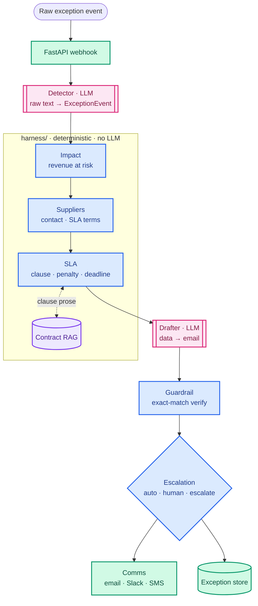

<div align="center">

# Resolv

**Autonomous Supply-Chain Exception Manager**

[](https://python.org)
[](https://google.github.io/adk-docs/)
[](https://groq.com)
[](https://fastapi.tiangolo.com)
[](https://www.sbert.net)
[](https://huggingface.co/docs/trl)

*A late shipment fires a webhook. 60 seconds later there's a costed, contract-cited, ready-to-send supplier email — and a decision on whether a human ever needs to see it.*

</div>

---

## What It Does

An order-management system emits a raw event: *seller `northwind-parts`, order `ORD-4471`, delivered 6 days past the estimate.*

Resolv classifies it as a `late_shipment`, sums the exact revenue at risk from the order book, looks up the supplier's SLA penalty clause, **retrieves the actual contract language** for that clause, drafts a firm supplier email that quotes it, **verifies the draft didn't drop the order ID or invent a dollar figure**, and then decides: auto-send, queue for human approval, or escalate. The dollar math and the send/hold decision are never left to a language model.

---

## Architecture



*Flow runs top→bottom. The two pink `[[ ]]` nodes are the only LLM calls; the blue box is the deterministic harness that owns all math, lookups, and the send/hold decision.*

**Two LLM calls, everything else deterministic.** Only *detection* (unstructured text → typed event) and *drafting* (structured data → prose) are language tasks. Impact math, supplier lookup, SLA calculation, draft verification, and the escalation decision are plain Python in [`harness/`](harness/) — no model is trusted to enforce its own constraints.

---

## The Core Idea — *the LLM proposes, the harness disposes*

The original design had six "agents." Four of them were arithmetic and table lookups wrapped in LLM calls — added cost, latency, and a fresh way to hallucinate, for nothing. Collapsing them into deterministic code is the central engineering decision, and it pays off twice: correctness becomes *guaranteed* instead of *probable*, and the same verifier that gates a live send becomes the reward signal for fine-tuning.

| Decision | Why |
|---|---|
| **2 LLM agents, not 6** | Only classification and drafting are language problems. Multi-agent systems burn ~15× the tokens of a single call — you add agents when they earn measurable value, not by default. |
| **`harness/guardrails.py` verifies draft content** | Exact-match checks — order IDs present, dollar amounts correct, SLA clause cited. A hallucinated figure in a supplier-facing legal notice fails the check *with certainty*, not a judge's guess. |
| **Escalation is a threshold table, not a prompt** | The model's own "rules" were already a fixed table (`confidence ≥ 0.85 AND revenue < $10k → auto_resolve`). Implemented once in Python, there is no gap between the stated rule and the applied one. |
| **The orchestrator is a plain function, not `sub_agents`** | A fixed-order business pipeline must never depend on a model *choosing* to call steps in sequence. Coordination/specification issues — not model limits — drive most multi-agent production failures. |
| **RAG supplies words, never numbers** | Retrieved contract prose grounds the drafter's citation; the clause ID and penalty dollars always come from the deterministic lookup. A similarity score is an estimate, not a verified fact. |

---

## Fine-Tuning — RLVR on the same verifier

The demanded ML skill, done end-to-end and reported honestly. A Qwen2.5-1.5B-Instruct + LoRA drafter is trained in three stages: **SFT** (190 domain email pairs) → **ORPO** (preference alignment, good vs. deliberately-bad drafts) → **GRPO / RLVR**.

What makes it **RLVR, not RLHF**: the reward is [`harness/guardrails.py`](harness/guardrails.py) — the *exact same deterministic check that gates a live send* (order ID present, amount correct), run on each rollout. No LLM judge anywhere. One definition of "did the draft get the facts right," used in both training and production.

**The result — measured on 100 held-out contexts** (rows 50–99 of the pools, never trained on) via [`scripts/eval_finetune.py`](scripts/eval_finetune.py): RLVR lifted fact-inclusion from **82% → 96%** (+0.29 on a 2-point scale) — *exactly the axis the reward optimized* — while tone stayed at the LLM-judge's ceiling (~4.9/5 for both base and fine-tuned, a ceiling effect, not a regression). The eval scores two axes: deterministic **facts** (the RLVR-optimized axis) and an LLM-judged **tone** score.

```
               facts (/2)   tone (/5)
BASE                 1.64        4.95
GRPO (RLVR)          1.93        4.93     Δ facts +0.29
```

The takeaway is honest and complementary, not either/or: the deterministic harness **guarantees** these facts at send time regardless of the model, *and* RLVR independently **sharpened** the model's own fact-inclusion. Correctness doesn't depend on the training — but the training still moved the exact metric it was rewarded on, on unseen data.

---

## RAG — grounded, and measured

Single-stage dense retrieval (`all-MiniLM-L6-v2`, cosine similarity) over unstructured SLA contract clauses in [`rag/contract_search.py`](rag/contract_search.py). No reranker: with a dozen clauses a second model adds cost for no accuracy gain at this corpus size. Wired into `harness/sla.py` so the drafter quotes real contract language ("*a service credit of 2% of the shipment value…*") instead of a bare clause number — while the money math stays deterministic. On a 10-query labeled eval it gets **100% top-1 accuracy** ([`tests/test_rag.py`](tests/test_rag.py)).

---

## Tech Stack

| Layer | Choice |
|---|---|
| **Agents** | Google ADK (`LlmAgent`, `output_schema`/`output_key`) — 2 agents only |
| **LLM** | Groq `llama-3.3-70b-versatile` via ADK's `LiteLlm`, 3-key rotation with rate-limit backoff; Gemini fallback |
| **Harness** | Deterministic Python — impact, suppliers, SLA, escalation, guardrails (no API key needed to test) |
| **RAG** | `sentence-transformers/all-MiniLM-L6-v2` (384-dim, local CPU), cosine over contract clauses |
| **Fine-tuning** | Qwen2.5-1.5B-Instruct + LoRA · LlamaFactory (SFT, ORPO) · TRL `GRPOTrainer` (RLVR) · W&B tracking |
| **Reward** | `harness/guardrails.py` deterministic verifier — reused as both the live gate and the GRPO reward |
| **API** | FastAPI webhook + exception-state endpoints |
| **Validation** | Pydantic v2 schemas ([`schemas.py`](schemas.py)) shared across agents, harness, and tests |
| **Datasets** | Olist (`late_shipment`) · DataCo (`price_dispute`) · amirmotefaker supply-chain (`quality_rejection`, `stockout`) |
| **Tests** | pytest — 39 tests (harness, RAG, reward), deterministic; harness suite needs no API key |

---

## Quick Start

```bash
git clone <repo> && cd Resolv
python -m venv venv && venv\Scripts\activate     # Windows
pip install -r requirements.txt
cp .env.example .env                             # add GROQ_API_KEY to exercise the 2 LLM agents

pytest tests/ -q                                 # harness + RAG + reward — no API key needed
uvicorn api.main:app --reload                    # POST a raw event to /exceptions/webhook
```

**Environment**

| Variable | Purpose |
|---|---|
| `GROQ_API_KEY` (+ `_2`, `_3`) | LLM for detector/drafter; extra keys enable rotation on rate limits |
| `GEMINI_API_KEY` | Optional fallback provider |
| `SEND_MODE` | `draft` (default, logs only) or `live` |
| `AUTO_RESOLVE_MAX_RISK_USD` · `AUTO_RESOLVE_CONFIDENCE_THRESHOLD` | Escalation thresholds |

The harness runs — and its tests pass — with no API key at all. A key is only needed to drive the two LLM agents end-to-end.
