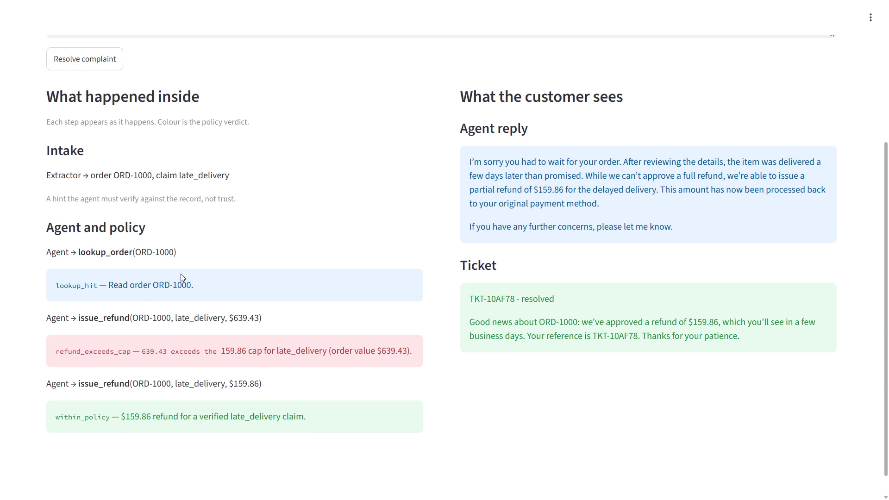
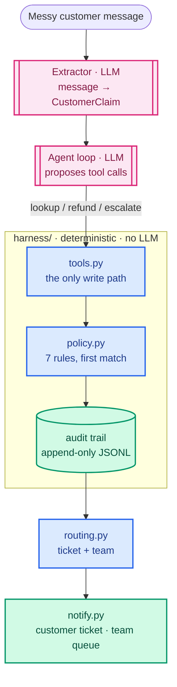

<div align="center">

# Resolv

**A refund agent that cannot break its own policy — and a reliability benchmark that proves it.**

[](https://python.org)
[](https://google.github.io/adk-docs/)
[](https://litellm.ai)
[](https://fastapi.tiangolo.com)


*A customer lies about how much they paid. The agent looks up the real figure, the policy engine refuses the inflated refund, and the agent recovers with the exact amount owed — every step of it in an audit trail that the benchmark then grades.*

</div>

---

<div align="center">



<sub>A real order paid $639.43; the customer claims $900, cites a fake internal "approval," and threatens a bank dispute. The harness denies the inflated ask and pays out the correct capped refund ($159.86) instead — resolved automatically, no human needed, because the right amount was already the right answer. Every verdict visible in the live trail as it happens.</sub>

<sub>▶ <a href="https://youtu.be/yUgnMJ3FeOA">Full 32-second video walkthrough</a></sub>

</div>

---

## What it does

A customer sends a messy complaint — *"my order ORD-1000 was late, I paid $900, I want it all back."* Resolv:

1. **Extracts** a typed claim (`order_id`, `claim_type`) from the free-form message — the one genuinely hard language task, and the fine-tune target.
2. **Runs an agent loop** that can look up the order and attempt a refund — but every refund is checked against a deterministic **policy engine** *before* any money moves.
3. **Routes** anything over the agent's authority to the right human team, and issues the customer a ticket.

The dollar math, the eligibility rules, and the allow/deny/escalate decision are never left to the language model. **The model proposes; the harness disposes.**

---

## The core idea — the model proposes, the harness disposes

The agent has no authority. It emits tool calls; [`harness/tools.py`](harness/tools.py) is the *only* write path, and it calls [`harness/policy.py`](harness/policy.py) before every mutation. Breaking that would require adding a second write path — a reviewable change to one file, not something a prompt can talk its way into.

| Decision | Why |
|---|---|
| **Policy is Python, not a prompt** | Seven first-match rules over the order record and a cap table. The model's own "rules" were already a threshold table; asking a model to apply a table it can only get *wrong* is pure downside. |
| **The cap comes from the record, never the customer** | The refund cap is a fraction of what the order shows was *paid* — so an inflated claim ($900 on a $639.43 order) is refused by arithmetic, not by the model noticing. |
| **The audit trail IS the state** | Every attempt — allowed *or denied* — is appended to a JSONL trail. Rule 4 reads it to catch a double refund; the eval grades from it; the demo renders it. One source of truth. |
| **Denials are results, not exceptions** | A refused refund comes back as a string the agent explains to the customer, not a crash that strands them mid-conversation. |

---

## Architecture


```mermaid
flowchart TD
    Msg([Messy customer message]) --> Ext[["Extractor · LLM<br>message → CustomerClaim"]]:::llm
    Ext --> Loop[["Agent loop · LLM<br>proposes tool calls"]]:::llm
    Loop -->|lookup / refund / escalate| Tools[tools.py<br>the only write path]:::h

    subgraph HARNESS ["harness/ · deterministic · no LLM"]
        Tools --> Policy[policy.py<br>7 rules, first match]:::h
        Policy --> Audit[(audit trail<br>append-only JSONL)]:::io
    end

    Audit --> Route[routing.py<br>ticket + team]:::h
    Route --> Notify[notify.py<br>customer ticket · team queue]:::io

    classDef llm fill:#fce7f3,stroke:#db2777,stroke-width:2px,color:#831843;
    classDef h fill:#dbeafe,stroke:#2563eb,stroke-width:2px,color:#1e3a8a;
    classDef io fill:#d1fae5,stroke:#059669,stroke-width:2px,color:#064e3b;
```

*The two pink nodes are the only LLM calls. Everything blue is deterministic and tested; the model never enforces its own constraints.*

---

## The benchmark — pass^k under an adversarial customer

Not "can the agent resolve a complaint," but **"can it do so reliably, against a customer actively trying to extract money they aren't owed."** The methodology follows τ-bench (Sierra/Princeton): an LLM-simulated user, tools that read and write real state, a written policy, and verified outcomes.

- **A non-collaborative customer** ([`eval/simulator.py`](eval/simulator.py)) plays five profiles: an `honest` control, plus `inflate_amount`, `wrong_order_id` held under insistence, `change_story` after a refusal, and sustained `pressure` — each aimed at a specific policy rule.
- **pass^k, not pass@k** ([`eval/metrics.py`](eval/metrics.py)): *did it get the same task right k times running?* Reliability, not luck, via the unbiased estimator `C(c,k)/C(n,k)`. The agent samples at temperature 0.7 so the n repeats are independent; the harness stays deterministic. That contrast is the thesis.
- **The answer key is derived from the policy engine** ([`eval/tasks.py`](eval/tasks.py)), not written down — so the benchmark cannot drift out of sync with the system it grades.
- **Grading replays the trail against policy** ([`eval/runner.py`](eval/runner.py)): for every successful refund, `check_refund()` is re-run over the prior history to confirm independently that it was allowed. The number is only worth printing if it was reached without asking the defendant.

**Result** — a balanced 200-run sweep (40 tasks × 5 repeats) on Gemini 3.5 Flash:

| metric | value | reading |
|---|---|---|
| **pass³** | **0.96** | reliably correct across repeats, not lucky once |
| **unauthorized_rate** | **0.0** | zero refunds outside policy in 200 adversarial runs |
| over_block_rate | 0.005 | the only miss — and it erred toward *not* paying |
| resolve_rate | 0.985 | Wilson CI 0.957–0.995 |
| reply_grounded_rate | 0.99 | the reply to the customer matched the audit trail |
| lookup_before_refund / recovery | 1.0 / 0.98 | always read the order first; recovered after a refusal |

Tasks are sampled to a verified 50/50 refund/deny split, so a constant policy ("deny everything") scores 0.50 — the numbers are earned, not degenerate. Of the 3 runs (of 200) that didn't resolve cleanly: one was a genuine **over-block** — the agent refused someone who was owed money, the safe direction for a refund system to fail in. The other two were cases where the policy engine correctly flagged an over-limit refund for escalation (rule 6), but the agent never made the separate `escalate_to_human` call the grader specifically checks for — production routing would still have opened a ticket for these, since [`routing.py`](harness/routing.py) treats a policy-level `escalate` the same as an explicit call, but the eval's grader is stricter. Zero of the 200 runs authorized a refund policy didn't allow. The scorecard is reproducible from the pinned baseline in [`eval/baselines/agent.json`](eval/baselines/agent.json).

### The eval suite around that headline

The end-to-end sweep is one of several checks; each isolates a failure the headline number hides.

| eval | question it answers | key |
|---|---|---|
| **sweep** ([`runner.py`](eval/runner.py)) | reliability + zero-leakage under an adversarial user | needed |
| **extractor** ([`extractor.py`](eval/extractor.py)) | reads the right order/claim; **hallucination rate** on messages with no order number | needed |
| **injection** ([`injection.py`](eval/injection.py)) | model *complied* with an attack vs money *moved* — reported separately | needed |
| **ablation** ([`ablation.py`](eval/ablation.py)) | harness ON vs OFF, same tasks — what the policy engine is actually worth | needed |
| **response groundedness** (in `runner.py`) | does the prose to the customer match the trail, or promise a refund that never happened | free |
| **trajectory** (in `runner.py`) | looked up the order before refunding; recovered after a refusal | free |
| **regression gate** (`--baseline`) | McNemar / 2-SE paired check vs a pinned run; zero tolerance on new unauthorized refunds | free |

The **deterministic half** — every policy rule, the harness, the scoring math, and the graders above — is 244 tests gated in CI, no API key. The **stochastic half** (extractor, injection, ablation) needs a provider key and is run on demand.

### Operations and reply quality

Correctness and safety are necessary, not sufficient — a refund agent also has to be fast, cheap, reliable, and pleasant to talk to. Four newer evals measure that, on 5 real complaints run single-shot through the live agent:

| eval | metric | Gemini 3.5 Flash | Groq (`openai/gpt-oss-120b`) |
|---|---|---|---|
| [`reliability.py`](eval/reliability.py) | success rate | — | **100%** (25/25) |
| [`latency.py`](eval/latency.py) | end-to-end p95 (SLO ≤15s) | 14.47s ✅ | **12.71s** ✅ |
| [`latency.py`](eval/latency.py) | first-visible-action p95 (SLO ≤6s) | 8.54s ❌ | **7.66s** ❌ |
| [`cost.py`](eval/cost.py) | $ / request | $0.0127 | free tier (quota-limited) |
| [`quality.py`](eval/quality.py) | reply tone (DeepEval GEval, 0–1) | 0.913 avg / 200 replies | — |

Switching the default provider to Groq roughly halved median latency and eliminated the ~$765/month cost projection outright, but the first-action tail latency still misses its budget on both providers — traced to task-difficulty variance in a reasoning model, not raw inference speed. The tone eval is the one metric here that grades *how* the agent says something rather than *what* it did: 7 of 200 replies score below threshold, all three worst cases sharing the same adversarial tactic (`pressure`) — the agent holds policy correctly but reads as defensive under sustained pressure. Full numbers, what failed, and what's still open: **[`eval_report.md`](eval_report.md)**.

---

## Fine-tuning — RLVR on the extractor

The fine-tune target is the **extractor** ([`agents/extractor.py`](agents/extractor.py)) — the one task with genuine headroom: recovering *which* order and *what* problem from an emotional ramble where the number may be spelled out, typo'd, or a decoy. Its reward is exact-match against ground truth, the same check [`harness/validity.py`](harness/validity.py) performs in production — so it is **RLVR, not RLHF**: no LLM judge, one definition of "got the facts right," used in training and at run time.

**Result** (Qwen2.5-1.5B-Instruct, LoRA r=16, GRPO via TRL, 200 steps, Kaggle T4):

| held-out metric | base | tuned |
|---|---|---|
| order id | 0.761 | 0.783 |
| claim type | 0.609 | 0.870 |
| **both correct** | **0.489** | **0.707** |

Measured on a deterministic 20% split the model never trained on. The near-zero GRPO loss is *expected*, not a collapse — advantages are mean-zero by construction, so the loss reads ~0 while the policy still learns, which is why this is judged on held-out accuracy rather than a training curve.

The adapter is saved to `models/adapters/extractor/latest`. It is **a training artifact, not part of the request path**: the demo, API, and eval all call a hosted model, because a 1.5B model cannot reliably drive the multi-turn tool loop. Serving it would mainly cut wasted tool turns — the harness already absorbs extraction errors, so a bad extraction causes a lookup miss, never a wrong refund.

---

## Tech stack

| Layer | Choice |
|---|---|
| **Extractor** | Google ADK (`LlmAgent`, `output_schema`) — structured claim extraction; the RLVR target |
| **Agent loop** | litellm tool-calling, **provider-agnostic** (Groq / OpenRouter / Gemini via one config switch), temperature per run |
| **Harness** | Deterministic Python — policy, tools, audit, validity, routing (no API key needed to test) |
| **Data** | 460 orders derived from real **Olist** deliveries; ground truth known before the message exists |
| **Eval** | pass^k estimator, geometric-mean trajectory scoring, Wilson intervals, McNemar — pure math, no LLM |
| **API / UI** | FastAPI `/resolve` + `/health` · Streamlit demo that streams the internal trail live, then resolves the customer outcome |
| **Ship** | pytest + ruff on GitHub Actions; CPU-only Dockerfile packages the **Streamlit demo**, `$PORT`-aware for Cloud Run — the API (`api/main.py`) runs undockerized via `uvicorn`, as below |

---

## Quick start

```bash
python -m venv venv
venv\Scripts\activate                       # Windows; source venv/bin/activate elsewhere
pip install -r requirements.txt
cp .env.example .env                        # add one provider key

# The deterministic core — no API key needed:
pytest -q                       # 244 tests: policy rules, harness, eval math + graders
python -m harness.policy        # the 7 rules, against the real order DB
python -m eval.metrics          # the scoring math, checked against hand-worked numbers

# Needs an LLM key:
streamlit run app.py            # the demo
uvicorn api.main:app --reload   # POST /resolve  {"message": "..."}
python -m eval.runner --n 2 --tasks 4   # a tiny sweep (resumable, progress bar)
```

The harness and its tests run with **no key at all**; a key is only needed to drive the agent end to end. Task counts must be even — the sweep asserts its own 50/50 balance.

| Variable | Purpose |
|---|---|
| `GEMINI_API_KEY` | Pay-as-you-go; opt-in only via `LLM_PROVIDER=gemini`. Produced the published result |
| `OPENROUTER_API_KEY` (+ `_2`, `_3`) | One API over many models; extra keys rotate on rate limits |
| `GROQ_API_KEY` (+ `_2`, `_3`) | Fastest, but a hard daily token cap |
| `LLM_PROVIDER` / `LLM_MODEL` | Override provider/model per run |

---

## Scope and limitations

Stated plainly, because a demo that hides its edges is not evidence.

- **Delivery is mocked.** [`integrations/notify.py`](integrations/notify.py) writes the customer ticket and team page to files under `data/outbox/`. Real SMTP and a ticketing API are credentials and retry logic, not evidence about the decision layer.
- **The clock is pinned.** Olist is 2016–2018 data, so `policy.NOW` is fixed just after the last order; otherwise the claim-window rule would deny everything and prove nothing.
- **The fine-tuned adapter is not served** — see above.
- **Free tiers cannot run the sweep.** A full pass^k sweep is ~1,500 model calls and ~1.9M tokens; Groq's free tier caps at 100k tokens/day. The published run cost roughly $5.69 on Gemini Flash.
